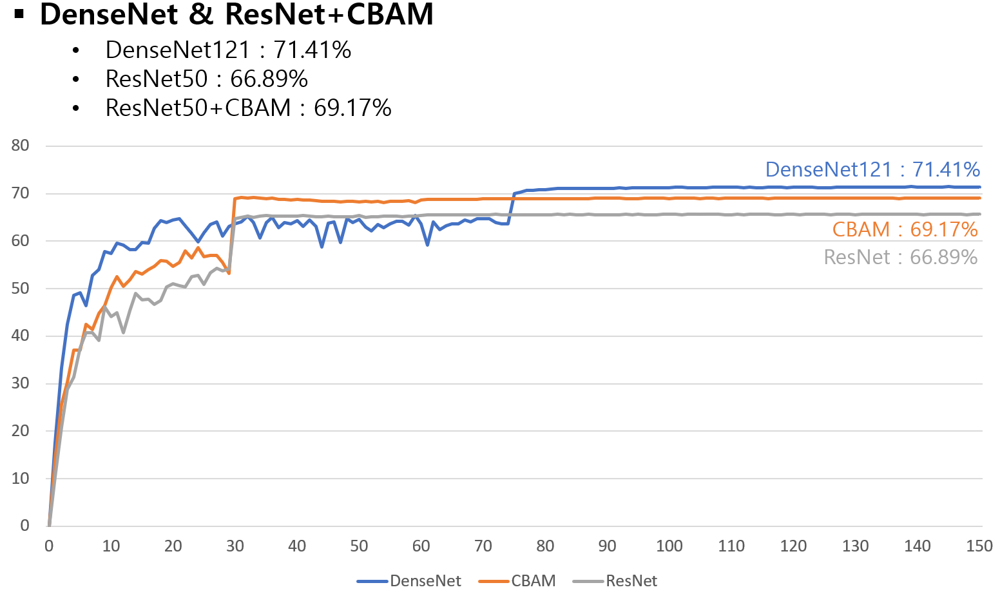

## Download weights
- [Google Driver](https://drive.google.com/file/d/1VqEQ7ZMYhtABlqZAx_h2eb1q5U1_8k7Z/view?usp=sharing)

## Dataset
- TinyImageNet_200

## Experiment
- model : ResNet50_CBAM
- OS : Ubuntu

- setting
  - 
  * Dataset
      1. Image : TinyImageNet
      2. Size : 128 x 128
      3. Train : 207,005
      4. Test : 51,752
      5. Class : 200

  * Augmentation
      1. Random Crop
      2. Random Horizontal Flip

  * HyperParameter
      1. EPOCH : 150
      2. Batch size : 256
      3. Optimizer : SGD
      4. Learning Rate : 0.01
      5. Scheduling : Multiply by 0.1 every 30 epochs
      6. Loss Function : Cross entropy
      7. Weight decay : 0.0005 

## Result

|     Model     |   Dataset         | acc (val) |
|:-------------:|:-----------------:|:---------:|
| ResNet50_CBAM | TinyImageNet_200  |  69.17%   |
|   ResNet50    | TinyImageNet_200  |  66.89%   |

## HeatMap sample
- [Download 200 class HeatMap Image](https://drive.google.com/file/d/1XechordlkP1Y3_KIfZAVTqDcP94ODcju/view?usp=sharing)

