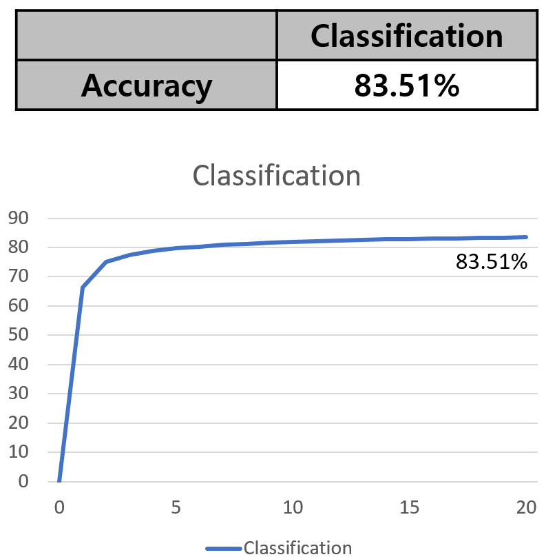

## Download weights
- [Google Driver](https://drive.google.com/file/d/1YO8zD5To2XbMsPkmD2QfUvY4pNLbIp8c/view?usp=sharing)

## Dataset
- TinyImageNet_200

## Experiment
- Pre-trained model : DINOv2-ViT-Base/14
- OS : Ubuntu

- setting
  - 
  * Dataset
      1. Image : TinyImageNet
      2. Size : 128 x 128
      3. Train : 207,005
      4. Test : 51,752
      5. Class : 200
      6. Pre-trained Dataset : LVD-142M

  * Augmentation
      1. Random Crop
      2. Random Horizontal Flip

  * HyperParameter
      1. EPOCH : 20
      2. Batch size : 4096
      3. Optimizer : SGD
      4. Learning Rate : 0.01
      5. Scheduling : Multiply by 0.1 every 60 epochs
      6. Loss Function : Cross entropy

## Result

|        Model        |     Dataset      |  acc (val) |
|:-------------------:|:----------------:|:----------:|
| DINOv2-ViT-Base/14  | TinyImageNet_200 |   83.51%   |

