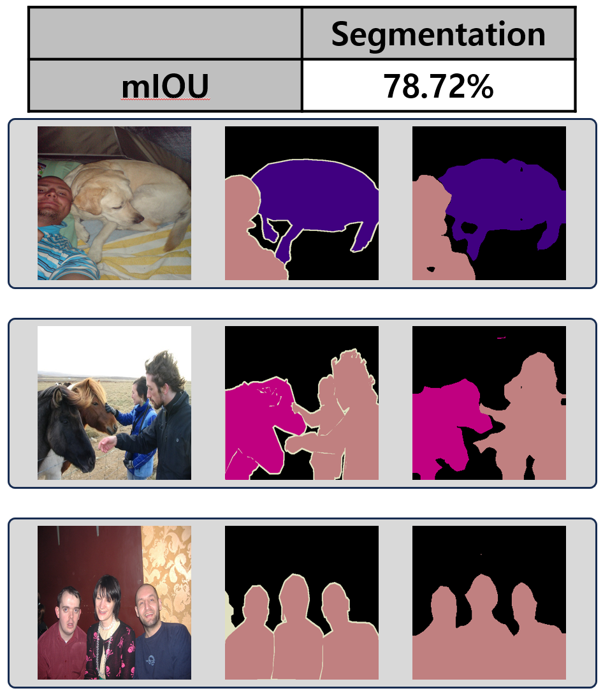

## Download weights
- [Google Driver](https://drive.google.com/file/d/1lCwrjO9r2F7M7butimECEECZ47np1ljx/view?usp=sharing)

## Dataset
- [VOCtrainval_11-May-2012](https://drive.google.com/file/d/1NV-QMB3XOVqkHCilVkszH_IzrvqonHRj/view?usp=sharing)

## Experiment
- Pre-trained model : DINOv2-ViT-Base/14
- OS : Ubuntu

- setting
  - 
  * Dataset
      1. Image : VOCtrainval_11-May-2012
      2. Size : 266 x 266
      3. Train : 10,582
      4. Test : 1,449
      5. Class : 21
      6. Pre-trained Dataset : LVD-142M

  * Augmentation
      1. Random Crop
      2. Random Horizontal Flip

  * HyperParameter
      1. EPOCH : 30
      2. Batch size : 64
      3. Optimizer : Adam
      4. Learning Rate : 0.01
      5. Scheduling : Multiply by 0.1 every 60 epochs
      6. Loss Function : Cross entropy

## Result

|        Model        |     Dataset      |       acc (val)       |
|:-------------------:|:----------------:|:---------------------:|
| DINOv2-ViT-Base/14  | VOCtrainval_11-May-2012 |        78.72%         |

- [30 epoch predict images download](https://drive.google.com/file/d/1DY3hsjEmkc8aUokm-698WEjBsKfdTSSb/view?usp=sharing)
