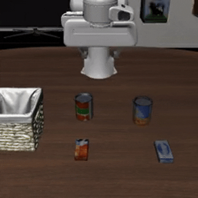

# OpenVLA-ECoT: Embodied CoT OpenVLA

 
<hr style="border: 2px solid gray;"></hr>

## Getting Started

## Installation

This repository was built using Python 3.10

Use the setup commands below to get started:

```bash
conda create -n openvla python=3.10 -y
conda activate openvla


conda install pytorch torchvision torchaudio pytorch-cuda=12.4 -c pytorch -c nvidia -y  # UPDATE ME!

git clone https://github.com/openvla/openvla.git
cd openvla
pip install -e .

pip install packaging ninja
ninja --version; echo $?
pip install "flash-attn==2.5.5" --no-build-isolation
```


### LIBERO Simulation Benchmark Evaluations


#### OpenVLA-ECoT Fine-Tuning Results

| Method                  | LIBERO-Spatial | LIBERO-Object | LIBERO-Goal | LIBERO-Long | Average    |
|-------------------------|----------------|---------------|-------------|-------------|------------|
| OpenVLA-ECoT fine-tuned | **89.0%**      | **78.0%**     | **82.0%**   | **68.0%**   | **79.25%** |

#### LIBERO Setup

```bash
git clone https://github.com/Lifelong-Robot-Learning/LIBERO.git
cd LIBERO
pip install -e .
```

Additionally, install other required packages:
```bash
cd openvla
pip install -r experiments/robot/libero/libero_requirements.txt
```

> **Note**: Please install the dependencies from libero_requirements.txt, then reinstall numpy==1.26.2 and opencv-python==4.9.0.80.

<span align="center"></span>

> Inference Reasoning Process Example
```
[New Thought]: Place both alphabet soup and tomato sauce in the basket.  PLAN:  1. Approach alphabet soup. 2. Grasp soup. 3. Transport to basket. 4. Reposition for tomato sauce. 5. Grasp sauce. 6. Transport to basket.  SUBTASK REASONING:  Confirming environment stability and obstacle-free path.  SUBTASK:  Initial positioning  MOVE REASONING:  Awaiting trajectory confirmation.  MOVE:  stop  GRIPPER POSITION: [83, 43, 84, 44, 84, 44, 85, 44, 82, 42] VISIBLE OBJECTS: a small rectangular object [193, 178, 220, 212], a robotic arm [76, 0, 177, 103] ACTION: 庄˚巴식飛達忠...

[New Thought]: Place both alphabet soup and tomato sauce in the basket.  PLAN:  1. Approach and grasp alphabet soup. 2. Transport to basket. 3. Reposition for tomato sauce. 4. Transport to basket.  SUBTASK REASONING:  Confirm no obstacles in the starting zone.  SUBTASK:  Initialize position.  MOVE REASONING:  Waiting for environment scan completion.  MOVE:  stop  GRIPPER POSITION: [79, 44, 79, 45, 81, 48, 83, 49, 82, 49] VISIBLE OBJECTS: a basket [0, 109, 61, 196], a can a can [92, 117, 120, 157], a robotic arm [72, 0, 172, 103], a small rectangular object [193, 179, 220, 212] ACTION: 孝˚巴식飛達忠...

[New Thought]: Place alphabet soup and tomato sauce in basket  PLAN:  Approach soup can, grasp, transport to basket, release; repeat for tomato sauce  SUBTASK REASONING:  Continue tilting to refine alignment with the soup can's location.  SUBTASK:  Align gripper with soup can  MOVE REASONING:  Fine-tune gripper positioning to avoid knocking over adjacent objects.  MOVE:  tilt down  GRIPPER POSITION: [79, 39, 80, 40, 82, 42, 86, 43, 89, 45] VISIBLE OBJECTS: a basket [0, 109, 61, 197], a can a can [93, 118, 120, 150], a small rectangular object [193, 179, 220, 212] ACTION: ŝ丁种식飛ɵ忠...

[New Thought]: Place both objects in the basket  PLAN: 1. Approach soup can; 2. Grasp soup; 3. Transport to basket; 4. Release soup; 5. Approach sauce; 6. Grasp sauce; 7. Transport to basket; 8. Release sauce  SUBTASK REASONING:  Continue lowering the gripper to ensure it does not collide with the soup can.  SUBTASK:  Approach soup can  MOVE REASONING:  Fine-tune gripper alignment to avoid colliding with the soup can.  MOVE:  tilt down  GRIPPER POSITION: [78, 36, 82, 35, 82, 34, 83, 34, 84, 34] VISIBLE OBJECTS: a basket [0, 109, 60, 196], a can [92, 117, 120, 157], a bottle [158, 77, 181, 126], a robotic arm [68, 0, 167, 103], a small rectangular box [160, 135, 189, 193], a carton a box [209, 122, 244, 178] ACTION: ѫន巴식ự操忠...

[New Thought]: Place tomato sauce in basket  PLAN:  Approach sauce, grasp, transport, release  SUBTASK REASONING:  Sauce is on the right; rotate clockwise to face it  SUBTASK:  Align with sauce  MOVE REASONING:  Fine-tune orientation for lateral movement  MOVE:  rotate clockwise  GRIPPER POSITION: [84, 39, 85, 40, 85, 40, 86, 40, 88, 40] VISIBLE OBJECTS: a basket [0, 109, 60, 195], a can [92, 117, 120, 157], a bottle [158, 78, 180, 126], a robotic arm [73, 0, 169, 103], a carton a box [209, 122, 244, 178] ACTION: 看월▓식飛達忠...

[New Thought]: Place tomato sauce in basket  PLAN:  Move left 7 times, then open gripper  SUBTASK REASONING:  Basket is left of the can; tilting down improves visibility.  SUBTASK:  Align gripper with sauce  MOVE REASONING:  Adjust gripper angle to match sauce bottle’s geometry.  MOVE:  tilt down  GRIPPER POSITION: [85, 39, 88, 39, 91, 41, 95, 41, 100, 43] VISIBLE OBJECTS: a basket [0, 109, 60, 196], a can [90, 118, 118, 157], a bottle [158, 77, 181, 125], a carton a box [209, 126, 245, 184] ACTION: む음巴식飛პ忠...

[New Thought]: Place tomato sauce in basket  PLAN:  Approach sauce, grasp, transport, release  SUBTASK REASONING:  Sauce is on the right; rotate clockwise to face it  SUBTASK:  Align with sauce  MOVE REASONING:  Fine-tune orientation for lateral movement  MOVE:  rotate clockwise  GRIPPER POSITION: [87, 37, 88, 38, 93, 38, 96, 38, 100, 37] VISIBLE OBJECTS: a basket [0, 109, 60, 195], a can [91, 117, 118, 155], a bottle [158, 78, 181, 126] ACTION: 銀내巴식边達忠...

[New Thought]: Place tomato sauce in basket  PLAN:  Move left 7 times for tomato sauce  SUBTASK REASONING:  Basket is left of the can; moving left/up avoids collisions.  SUBTASK:  Transport sauce to basket  MOVE REASONING:  Leftward motion navigates around cans and tomato sauce.  MOVE:  move left, tilt up  GRIPPER POSITION: [95, 39, 103, 39, 107, 40, 110, 39, 109, 39] VISIBLE OBJECTS: a basket [0, 109, 59, 196], a can [92, 117, 120, 156], a bottle [156, 77, 180, 125], a robotic arm [74, 0, 167, 103], a carton a box [209, 123, 244, 178] ACTION: ѫญ巴식飛達忠...

[New Thought]: Place both objects in the basket  PLAN: 1. Move left toward basket 2. Rotate gripper 3. Descend 4. Release  SUBTASK REASONING:  Basket is on the left; counterclockwise rotation orients gripper for leftward path SUBTASK:  Align gripper with basket  MOVE REASONING:  Simultaneous lateral movement and rotation to align gripper with basket location MOVE:  move left, rotate counterclockwise GRIPPER POSITION: [84, 33, 84, 33, 84, 33, 84, 34, 84, 34] VISIBLE OBJECTS: a basket [0, 109, 59, 195], a can [90, 118, 118, 158], a bottle [158, 77, 181, 126], a robotic arm [64, 0, 167, 103], a small rectangular object [193, 179, 220, 212] ACTION: ѫ项巴ഷ飛達忠...

[New Thought]: Place tomato sauce in basket PLAN: 1. Move left 2. Hover over basket 3. Open gripper SUBTASK REASONING: Basket’s position requires leftward movement after ascent SUBTASK: Finalize placement MOVE REASONING: Ascending to clear obstacles before horizontal traversal MOVE: move up GRIPPER POSITION: [59, 0, 77, 17, 78, 14, 78, 14, 79, 14] VISIBLE OBJECTS: a basket [0, 109, 60, 196], a can a can [91, 117, 118, 155], a bottle [157, 77, 181, 126] ACTION: ѫ과巴仮̍達忠..."
```
#### Launching LIBERO Evaluations

The OpenVLA models fine-tuned with LoRA (r=32) for LIBERO simulations are available on Hugging Face. Checkpoints are provided for LIBERO-Spatial, LIBERO-Object, LIBERO-Goal, and LIBERO-10.:
* [OpenVLA-ECoT/ecot-libero-spatial-r32](https://huggingface.co/DongJooAn/ecot-libero-spatial-r32)
* [OpenVLA-ECoT/ecot-libero-object-r32](https://huggingface.co/DongJooAn/ecot-libero-object-r32)
* [OpenVLA-ECoT/ecot-libero-goal-r32](https://huggingface.co/DongJooAn/ecot-libero-goal-r32)
* [OpenVLA-ECoT/ecot-libero-10-r32](https://huggingface.co/DongJooAn/ecot-libero-10-r32)

To start evaluation with one of these checkpoints, run one of the commands below. Each will automatically download the appropriate checkpoint listed above.

```bash
# Launch LIBERO-Spatial evals
cd <absolute_path_to_OpenVLA-ECoT_directory>

python experiments/robot/libero/run_libero_eval.py \
  --model_family openvla \
  --pretrained_checkpoint ./ecot-libero-spatial-r32 \
  --task_suite_name libero_spatial \
  --center_crop True

# Launch LIBERO-Object evals
python experiments/robot/libero/run_libero_eval.py \
  --model_family openvla \
  --pretrained_checkpoint ./ecot-libero-object-r32 \
  --task_suite_name libero_object \
  --center_crop True

# Launch LIBERO-Goal evals
python experiments/robot/libero/run_libero_eval.py \
  --model_family openvla \
  --pretrained_checkpoint ./ecot-libero-goal-r32 \
  --task_suite_name libero_goal \
  --center_crop True

# Launch LIBERO-10 (LIBERO-Long) evals
python experiments/robot/libero/run_libero_eval.py \
  --model_family openvla \
  --pretrained_checkpoint ./ecot-libero-10-r32 \
  --task_suite_name libero_10 \
  --center_crop True
```
> **Notes** : If you encounter an error indicating that libero cannot be found after running the code, please enter the following command in your terminal and run it again:
```bash
export PYTHONPATH=$PYTHONPATH:<absolute_path_to_LIBERO_directory>
```

