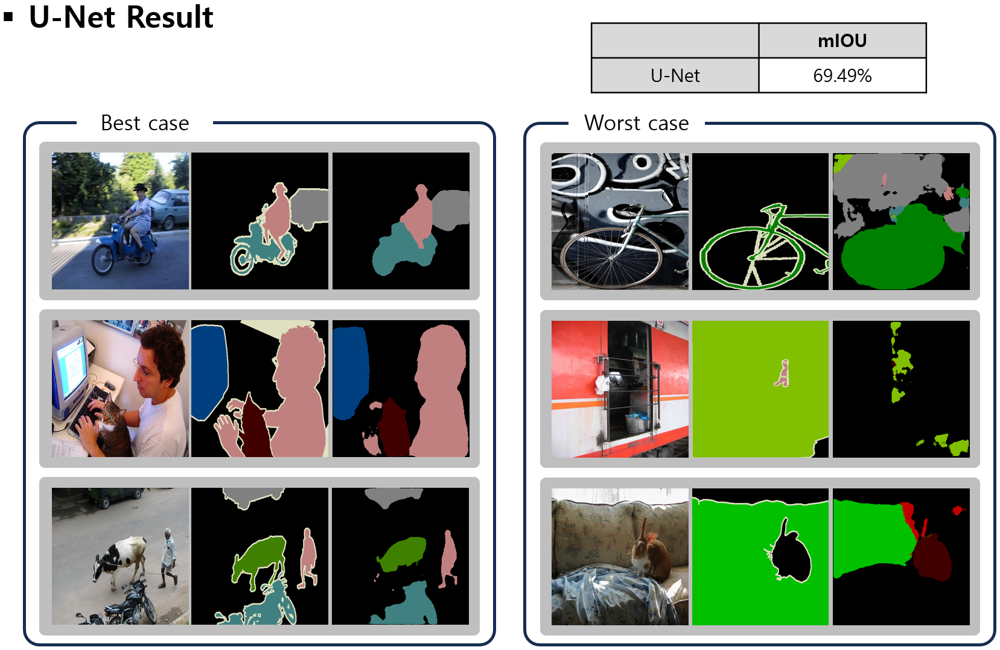

## Download weights
- torchvision.models.vgg16_bn (Used for downsampling.)

## Dataset
- [VOCtrainval_11-May-2012](https://drive.google.com/file/d/1NV-QMB3XOVqkHCilVkszH_IzrvqonHRj/view?usp=sharing)

## Experiment
- model : U-Net

- setting
  - 
  * Dataset
      1. Image : VOCtrainval_11-May-2012
      2. Size : 256 x 256
      3. Train : 10,582
      4. Test : 1,449
      5. Class : 21

  * Augmentation
      1. Random Crop
      2. Random Horizontal Flip

  * HyperParameter
      1. EPOCH : 60
      2. Batch size : 64
      3. Optimizer : Adam
      4. Learning Rate : 0.0001
      5. Scheduling : Multiplied by 0.1 every 30 epoch
      6. Loss Function : Cross entropy Loss

## Result

| Model |        Dataset          | mIOU (val) |
|:-----:|:-----------------------:|:----------:|
| U-Net | VOCtrainval_11-May-2012 |   69.49%   |

