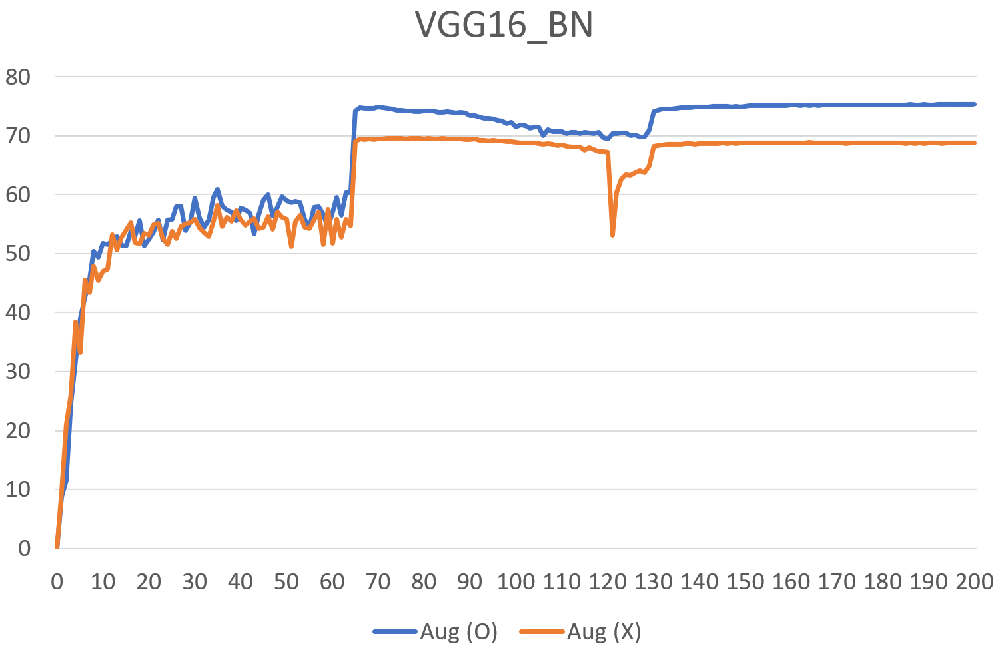

## Download weights
- [Google Driver](https://drive.google.com/file/d/1tJmqafa0gLnAE2GGOwX7qUD6cdeZ_bCB/view?usp=sharing)

## Dataset
- TinyImageNet_200

## Experiment
- model : VGG16_BN

- setting
  - 
  * Dataset
      1. Image : TinyImageNet
      2. Size : 128 x 128
      3. Train : 207,005
      4. Test : 51,752
      5. Class : 200

  * Augmentation
      1. Random Crop
      2. Random Horizontal Flip

  * HyperParameter
      1. EPOCH : 200
      2. Batch size : 256
      3. Optimizer : SGD
      4. Loss Function : Cross entropy
  

## Result

|  Model   |     Dataset      | augmentation (O) acc (val) | Augmentation (X) acc (val) |
|:--------:|:----------------:|:--------------------------:|:--------------------------:|
| VGG16_BN | TinyImageNet_200 |           75.36%           |           69.62%           |

