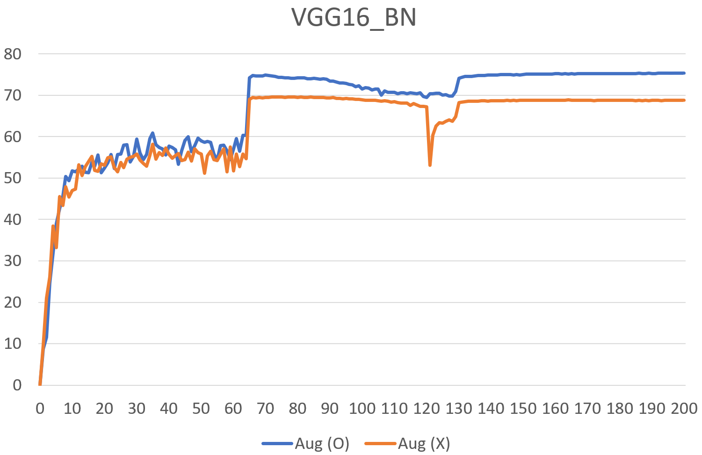

## model Overview
- 논문 정보 : K. Simonyan, & A. Zisserman, Very deep convolutional networks for large-scale image recognition. ICLR 2014
- 핵심 요약 : 기존 CNN 모델들이 비교적 큰 크기의 필터(7x7, 11x11)를 사용했던 것과를 달리, VGGNet은 비교적 작은 3x3 convolution filter만을 연속으로 사용합니다. 
이로 인해 더 적은 연산량에 비해 비슷한 학습 효과를 낼 수 있고 네트워크의 깊이를 19층까지 늘려 비선형성을 증가시킨 아키텍처입니다.

## model architecture

## Download weights
- [Hugging Face](https://huggingface.co/DongJooAn/VGG/tree/main)

## Dataset
- TinyImageNet_200

## Experiment
- model : VGG16_BN
- OS : Ubuntu

- setting
  - 
  * Dataset
      1. Image : TinyImageNet
      2. Size : 128 x 128
      3. Train : 207,005
      4. Test : 51,752
      5. Class : 200

  * Augmentation
      1. Random Crop
      2. Random Horizontal Flip

  * HyperParameter
      1. EPOCH : 200
      2. Batch size : 256
      3. Optimizer : SGD
      4. Loss Function : Cross entropy
  

## Result

|  Model   |     Dataset      | augmentation (O) acc (val) | Augmentation (X) acc (val) |
|:--------:|:----------------:|:--------------------------:|:--------------------------:|
| VGG16_BN | TinyImageNet_200 |           75.36%           |           69.62%           |

## Troubleshooting & Takeaways
이 프로젝트는 컴퓨터 비전 인공지능을 처음 접하며 진행한 첫 아키텍처 구현 경험으로, 공부를 위해 모델의 아키텍처, 코드를 검색하지 않고 오로지 논문만으로 구현했습니다. 
이로 인해 기본적인 환경 세팅, 데이터 처리, 모델 학습 과정을 밑바닥부터 체득한 경험이였습니다.

**1. 리눅스(Ubuntu) 환경 적응 및 GPU 메모리 제어**

문제 & 해결: 윈도우 환경을 벗어나 Ubuntu CLI 환경에서 경로를 설정하고 로컬 서버 환경에 모델을 맞추는 첫 과정부터 큰 벽이었습니다. 이 과정에서 CUDA 기반의 GPU 사용법을 익히고, 텐서를 명시적으로 GPU 메모리에 올리고(.to(DEVICE)) 내리는 흐름을 이해했습니다. 단순히 코드가 돌아가는 것을 넘어, 내 하드웨어 환경(GPU 메모리 등)에 맞춰 Batch Size를 조절하며 OOM(Out of Memory)을 방지하는 시스템 자원 통제력을 길렀습니다.

2. 밑바닥부터 구현한 데이터 전처리와 미니배치(Mini-batch) 파이프라인

문제 & 해결: 초기에는 PyTorch의 고수준 라이브러리(DataLoader, transforms)에 의존하지 않고 Numpy와 OpenCV만을 활용해 수만 장의 데이터를 메모리에 로드하려다 심각한 병목을 겪었습니다.

배운 점: 이를 해결하며 데이터 증강(Random Crop, Flip 등)이 적용되는 시점, 픽셀 정규화(Normalization), 그리고 데이터를 미니배치 단위로 쪼개어 모델에 공급하는 전체 데이터 파이프라인의 원리를 뼈저리게 이해할 수 있었습니다.

3. 텐서 차원(Feature Dimension) 추적과 논문의 코드화

문제 & 해결: 논문의 아키텍처 그림을 PyTorch 클래스로 직역할 때, 여러 개의 층을 통과하며 변하는 [Batch, Channel, Height, Width] 차원을 맞추지 못해 수많은 에러를 마주했습니다.

배운 점: Convolution의 Stride, Padding과 MaxPool을 거칠 때마다 변화하는 Feature Map의 사이즈를 수학적으로 직접 계산하고 추적하는 훈련을 반복했습니다. 특히 Fully Connected Layer로 넘어가기 전의 Flatten 차원을 정확히 도출해 내면서, CNN 내부의 블랙박스를 걷어내고 텐서의 흐름을 완전히 장악하는 시각을 갖추게 되었습니다.

4. 하이퍼파라미터(Hyperparameter) 튜닝이 가져오는 나비효과 체감

배운 점: 아키텍처 구현 후 학습을 진행하며, Learning Rate의 미세한 조정이나 Optimizer의 선택, 데이터 Augmentation의 비율 등 아주 작은 하이퍼파라미터 변동이 최종 정확도(Accuracy)에 극적인 차이를 만들어낸다는 것을 정량적으로 확인했습니다. 이를 통해 딥러닝 개발이 단순한 구현을 넘어선 '정교한 변수 통제와 실험의 과학'임을 깨달았습니다.
