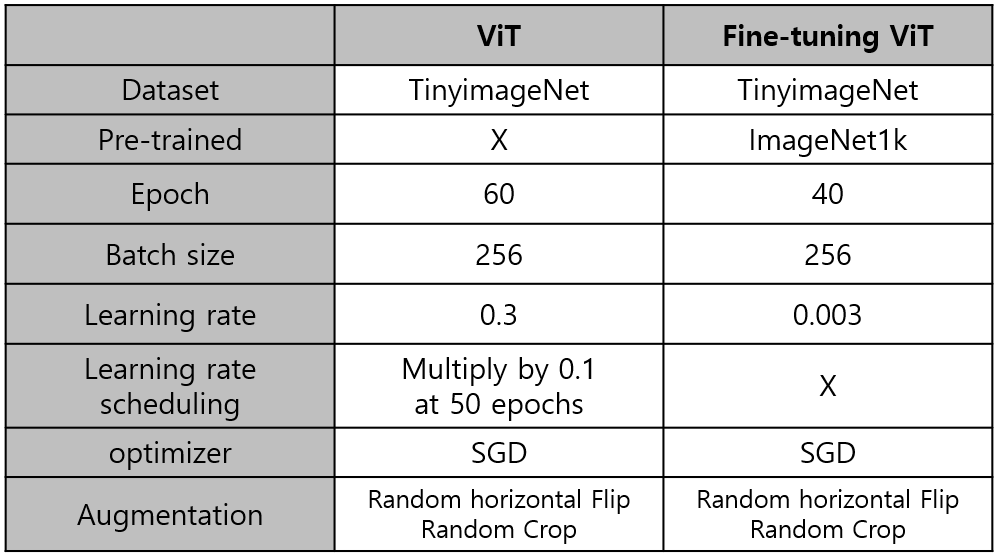
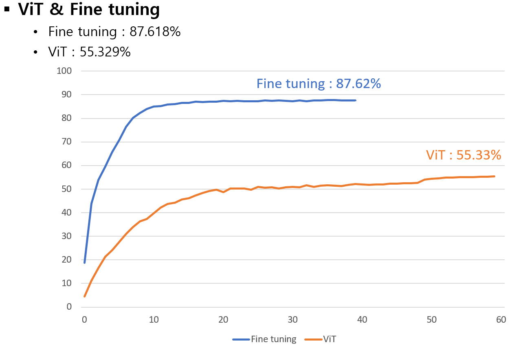

## Dataset
- TinyImageNet_200
## Experiment
- model : ViT_Base/16

- Scratch setting
  - 
  * Dataset
      1. Image : TinyImageNet
      2. Size : 128 x 128
      3. Train : 207,005
      4. Test : 51,752
      5. Class : 200

  * Augmentation
      1. Random Crop
      2. Random Horizontal Flip

  * HyperParameter
      1. EPOCH : 60
      2. Batch size : 256
      3. Optimizer : SGD
      4. Learning Rate : 0.3
      5. Scheduling : Multiply by 0.1 at 50 epoch
      6. Loss Function : Cross entropy Loss
      7. Patch Size : 16

- Fune tuning setting
  - 
  * Dataset
      1. Image : TinyImageNet
      2. Size : 128 x 128
      3. Train : 207,005
      4. Test : 51,752
      5. Class : 200
      6. Pre-trained Dataset : ImageNet1k 

  * Augmentation
      1. Random Crop
      2. Random Horizontal Flip

  * HyperParameter
      1. EPOCH : 40
      2. Batch size : 256
      3. Optimizer : SGD
      4. Learning Rate : 0.003
      5. Scheduling : X
      6. Loss Function : Cross entropy Loss
      7. Patch Size : 16 

## Result

|      Model      |    Dataset     | Acc (val) |
|:---------------:|:--------------:|:---------:|
|       ViT       |  TinyImageNet  |  55.33%   |
| ViT-Fine tuning | TinyImageNet   |  87.62%   |

