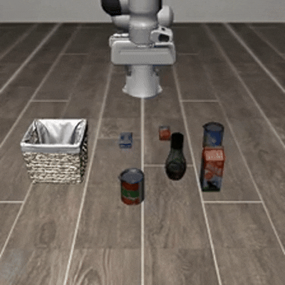

# OpenVLA: An Open-Source Vision-Language-Action Model

<hr style="border: 2px solid gray;"></hr>

This experiment was conducted by modifying the official GitHub codebase, based on the original OpenVLA paper: https://github.com/openvla/openvla

## Getting Started

## Installation

This repository was built using Python 3.10

Use the setup commands below to get started:

```bash
conda create -n openvla python=3.10 -y
conda activate openvla


conda install pytorch torchvision torchaudio pytorch-cuda=12.4 -c pytorch -c nvidia -y  # UPDATE ME!

git clone https://github.com/openvla/openvla.git
cd openvla
pip install -e .

pip install packaging ninja
ninja --version; echo $?
pip install "flash-attn==2.5.5" --no-build-isolation
```


### LIBERO Simulation Benchmark Evaluations


#### OpenVLA Fine-Tuning Results

| Method              | LIBERO-Spatial | LIBERO-Object | LIBERO-Goal | LIBERO-Long | Average   |
|---------------------|----------------|---------------|-------------|-------------|-----------|
| OpenVLA fine-tuned  | **89.0%**      | **76.0%**     | **78.7%**   | **62.0%**   | **76.4%** |

#### LIBERO Setup

```bash
git clone https://github.com/Lifelong-Robot-Learning/LIBERO.git
cd LIBERO
pip install -e .
```

Additionally, install other required packages:
```bash
cd openvla
pip install -r experiments/robot/libero/libero_requirements.txt
```

> **Note**: Please install the dependencies from libero_requirements.txt, then reinstall numpy==1.26.2 and opencv-python==4.9.0.80.

<span align="center"></span>

## Dataset
- LIBERO

## Inference
- Model : OpenVLA (Vision : SigLIP, DINOv2, LLM : Llama 2-7b)
- Fine-Tuning Method : LoRA (Low-Rank Adaptation)
- LoRA Rank ($r$) : 32
- Action Space : 7-DoF (Continuous, Un-normalized)
- OS : Ubuntu

### Evaluation Setting

* Dataset
    1. Task : LIBERO-spatial, LIBERO-object, LIBERO-goal, LIBERO-10, LIBERO-90
    2. Size : 224 x 224 (Center Cropped)
    3. Observation Space : RGB Image + Proprioceptive State (End-effector, Axis-Angle, Gripper Q-pos)

* HyperParameter
    1. Initial Wait Steps : 10
    2. Num episodes per task : 50
    3. Max episode steps : spatial(220), object(280), goal(300), 10(520)
  4. 
#### Launching LIBERO Evaluations

The OpenVLA models fine-tuned with LoRA (r=32) for LIBERO simulations are available on Hugging Face. Checkpoints are provided for LIBERO-Spatial, LIBERO-Object, LIBERO-Goal, and LIBERO-10.:
* [openvla/openvla-7b-finetuned-libero-spatial](https://huggingface.co/openvla/openvla-7b-finetuned-libero-spatial)
* [openvla/openvla-7b-finetuned-libero-object](https://huggingface.co/openvla/openvla-7b-finetuned-libero-object)
* [openvla/openvla-7b-finetuned-libero-goal](https://huggingface.co/openvla/openvla-7b-finetuned-libero-goal)
* [openvla/openvla-7b-finetuned-libero-10](https://huggingface.co/openvla/openvla-7b-finetuned-libero-10)

To start evaluation with one of these checkpoints, run one of the commands below. Each will automatically download the appropriate checkpoint listed above.

```bash
# Launch LIBERO-Spatial evals
cd <absolute_path_to_OpenVLA_directory>

python experiments/robot/libero/run_libero_eval.py \
  --model_family openvla \
  --pretrained_checkpoint ./openvla-7b-finetuned-libero-spatial \
  --task_suite_name libero_spatial \
  --center_crop True

# Launch LIBERO-Object evals
python experiments/robot/libero/run_libero_eval.py \
  --model_family openvla \
  --pretrained_checkpoint ./openvla-7b-finetuned-libero-object \
  --task_suite_name libero_object \
  --center_crop True

# Launch LIBERO-Goal evals
python experiments/robot/libero/run_libero_eval.py \
  --model_family openvla \
  --pretrained_checkpoint ./openvla-7b-finetuned-libero-goal \
  --task_suite_name libero_goal \
  --center_crop True

# Launch LIBERO-10 (LIBERO-Long) evals
python experiments/robot/libero/run_libero_eval.py \
  --model_family openvla \
  --pretrained_checkpoint ./openvla-7b-finetuned-libero-10 \
  --task_suite_name libero_10 \
  --center_crop True
```
> **Notes** : If you encounter an error indicating that libero cannot be found after running the code, please enter the following command in your terminal and run it again:
```bash
export PYTHONPATH=$PYTHONPATH:<absolute_path_to_LIBERO_directory>
```

